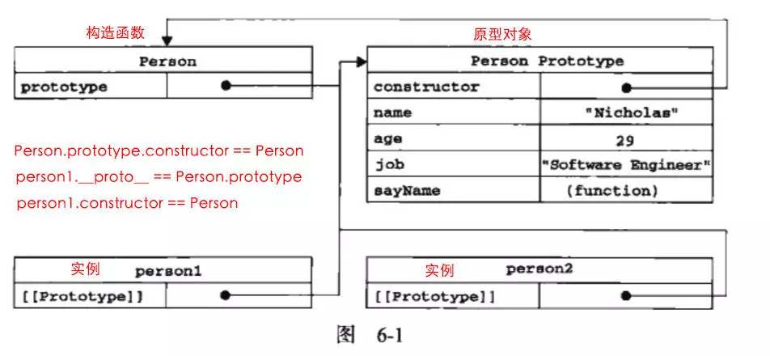

[LINK1](https://www.jianshu.com/p/dee9f8b14771)
## 须知概念点
  - 普通对象与函数对象
  - 构造函数
  - 原型对象 
  - __proto__ 
  - 构造器
  - 原型链
  - Prototype 只有函数对象才有

## 普通对象与函数对象
> 凡是通过new Function() 创建的对象都是函数对象

## 构造函数
```js
 function Person(name){
   this.name = name
 }
 var person1 = new Person('haha')
 var person2 = new Person('xixi)
 person1.constructor == Person
 person2.constructor == Person
```
> 面的例子中 person1 和 person2 都是 Person 的实例。这两个实例都有一个 constructor （构造函数）属性，该属性（是一个指针）指向 Person
我们要记住两个概念（构造函数，实例）：
person1 和 person2 都是 构造函数 Person 的实例
一个公式：
实例的构造函数属性（constructor）指向构造函数。

## 原型对象 
> 每个函数对象都有一个prototype属性 这个属性指向函数的原型对象
> 每个对象都有 __proto__ 属性，但只有函数对象才有 prototype 属性
```js
function Person(){
  Person.prototype.name="kiko"
  Person.prototype.sayName = function(){
    console.log(this.name)
  }
}
Person.prototype.age = 20
var person1 = new Person()
person1.sayName()
var person2 = new Person()
person2.sayName()
console.log(person1.sayName() === person2.sayName())
```
> 原型对象就是 Person.prototype
```js
Person.prototype = {
   name:  'Zaxlct',
   age: 28,
   job: 'Software Engineer',
   sayName: function() {
     alert(this.name);
   }
}
```

:::tip
在默认情况下，所有的原型对象都会自动获得一个 constructor（构造函数）属性，这个属性（是一个指针）指向 prototype 属性所在的函数（Person）
:::
> Person.prototype.constructor == Person
```js
person1.constructor == Pferson
Person.prototype.constructor == Person
```
> 原型对象（Person.prototype）是 构造函数（Person）的一个实例


> 原型对象其实就是普通对象（但 Function.prototype 除外，它是函数对象，但它很特殊，他没有prototype属性（前面说道函数对象都有prototype属性））

```js
 function Person(){};
 console.log(Person.prototype) //Person{}
 console.log(typeof Person.prototype) //Object
 console.log(typeof Function.prototype) // Function，这个特殊
 console.log(typeof Object.prototype) // Object
 console.log(typeof Function.prototype.prototype) //undefined
```

> 上文提到凡是通过 new Function( ) 产生的对象都是函数对象。因为 A 是函数对象，所以Function.prototype 是函数对象。
> 那原型对象是用来做什么的呢？主要作用是用于继承
```js
var Person = function(name){
    this.name = name; // tip: 当函数执行时这个 this 指的是谁？
  };
  Person.prototype.getName = function(){
    return this.name;  // tip: 当函数执行时这个 this 指的是谁？
  }
  var person1 = new person('Mick');
  person1.getName(); //Mick
```
> 从这个例子可以看出，通过给 Person.prototype 设置了一个函数对象的属性，那有 Person 的实例（person1）出来的普通对象就继承了这个属性。具体是怎么实现的继承，就要讲到下面的原型链了

##  __proto__
> JS 在创建对象（不论是普通对象还是函数对象）的时候，都有一个叫做__proto__ 的内置属性，用于指向创建它的构造函数的原型对象
> 对象 person1 有一个 __proto__属性，创建它的构造函数是 Person，构造函数的原型对象是 Person.prototype ，所以：person1.__proto__ == Person.prototype

```js
Person.prototype.constructor == Person;
person1.__proto__ == Person.prototype;
person1.constructor == Person;
```
> 不过，要明确的真正重要的一点就是，这个连接存在于实例（person1）与构造函数（Person）的原型对象（Person.prototype）之间，而不是存在于实例（person1）与构造函数（Person）之间。

## 构造器
```js
var obj = {}
//等价于
var obj = new Object()
//obj 是构造函数（Object）的一个实例。所以：
obj.constructor === Object
obj.__proto__ === Object.prototype
```
> 新对象 obj 是使用 new 操作符后跟一个构造函数来创建的。构造函数（Object）本身就是一个函数（就是上面说的函数对象），它和上面的构造函数 Person 差不多。只不过该函数是出于创建新对象的目的而定义的。所以不要被 Object 吓倒
> 同理，可以创建对象的构造器不仅仅有 Object，也可以是 Array，Date，Function等。
所以我们也可以构造函数来创建 Array、 Date、Function

```js
var b = new Array();
b.constructor === Array;
b.__proto__ === Array.prototype;

var c = new Date(); 
c.constructor === Date;
c.__proto__ === Date.prototype;

var d = new Function();
d.constructor === Function;
d.__proto__ === Function.prototype;
```

## 原型链
person1.__proto__ 是什么？

Person.__proto__ 是什么？

Person.prototype.__proto__ 是什么？

Object.__proto__ 是什么？

Object.prototype.__proto__ 是什么？

Function.__proto__ == Function.prototype

Function.prototype.__proto__ == Object.prototype

Object instanceof Function -->
Object.__proto__ === Function.prototype

Function instanceof Object -->
Function.__proto__.__proto__ == Object.prototype
> Object是Function的实例对象, Function.prototype是Object的实例对象
答案：
> 实例对象的constructor属性指向其构造函数, 因此Object.constructor === Function, Function.constructor === Function.
第一题：

因为 person1.__proto__ === person1 的构造函数.prototype

因为 person1的构造函数 === Person

所以 person1.__proto__ === Person.prototype

第二题：

因为 Person.__proto__ === Person的构造函数.prototype

因为 Person的构造函数 === Function

所以 Person.__proto__ === Function.prototype

第三题：

Person.prototype 是一个普通对象，我们无需关注它有哪些属性，只要记住它是一个普通对象。

因为一个普通对象的构造函数 === Object

所以 Person.prototype.__proto__ === Object.prototype

第四题，参照第二题，因为 Person 和 Object 一样都是构造函数
Function.prototype

第五题：

Object.prototype 对象也有proto属性，但它比较特殊，为 null 。因为 null 处于原型链的顶端，这个只
能记住。

Object.prototype.__proto__ === null


## __proto__(对象内部原型) 与 prototype(构造器的原型)

### 所有构造器/函数的__proto__都指向Function.prototype，它是一个空函数（Empty function）
```js
Number.__proto__ === Function.prototype  // true
Boolean.__proto__ === Function.prototype // true
String.__proto__ === Function.prototype  // true
Object.__proto__ === Function.prototype  // true
Function.__proto__ === Function.prototype // true
Array.__proto__ === Function.prototype   // true
RegExp.__proto__ === Function.prototype  // true
Error.__proto__ === Function.prototype   // true
Date.__proto__ === Function.prototype    // true
```
```js
Math.__proto__ === Object.prototype  // true
JSON.__proto__ === Object.prototype  // true
```
> 自定义
```js
// 函数声明
function Person() {}
// 函数表达式
var Man = function() {}
console.log(Person.__proto__ === Function.prototype) // true
console.log(Man.__proto__ === Function.prototype)    // true
```
> 所有的构造器都来自于Function.prototype，甚至包括根构造器Object及Function自身。所有构造器都继承了Function.prototype的属性及方法。如length、call、apply、bind（ES5）。
> Function.prototype也是唯一一个typeof XXX.prototype为 “function”的prototype。其它的构造器的prototype都是一个对象。如下

```js
console.log(typeof Function.prototype) // function
console.log(typeof Object.prototype)   // object
console.log(typeof Number.prototype)   // object
console.log(typeof Boolean.prototype)  // object
console.log(typeof String.prototype)   // object
console.log(typeof Array.prototype)    // object
console.log(typeof RegExp.prototype)   // object
console.log(typeof Error.prototype)    // object
console.log(typeof Date.prototype)     // object
console.log(typeof Object.prototype)   // object

```
> 知道了所有构造器（含内置及自定义）的__proto__都是Function.prototype，那Function.prototype的__proto__是谁呢？
```js
console.log(Function.prototype.__proto__ === Object.prototype) // true
```
> javascript 引擎内置构造器
```js
var obj = {name: 'jack'}
var arr = [1,2,3]
var reg = /hello/g
var date = new Date
var err = new Error('exception')
 
console.log(obj.__proto__ === Object.prototype) // true
console.log(arr.__proto__ === Array.prototype)  // true
console.log(reg.__proto__ === RegExp.prototype) // true
console.log(date.__proto__ === Date.prototype)  // true
console.log(err.__proto__ === Error.prototype)  // true
```
> 自定义
```js
function Person(name) {
    this.name = name
}
var p = new Person('jack')
console.log(p.__proto__ === Person.prototype) // true
```
> 每个对象都有一个constructor属性，可以获取它的构造器，因此以下打印结果也是恒等的
```js
function Person(name) {
    this.name = name
}
var p = new Person('jack')
console.log(p.__proto__ === p.constructor.prototype) // true
```
> 可以看到p.__proto__与Person.prototype，p.constructor.prototype都是恒等的，即都指向同一个对象。
> 如果换一种方式设置原型，结果就有些不同了
```js
function Person(name) {
    this.name = name
}
// 重写原型
Person.prototype = {
    getName: function() {}
}
var p = new Person('jack')
console.log(p.__proto__ === Person.prototype) // true
console.log(p.__proto__ === p.constructor.prototype) // false
```
>这里直接重写了Person.prototype（注意：上一个示例是修改原型）。输出结果可以看出p.__proto__仍然指向的是Person.prototype，而不是p.constructor.prototype。

这也很好理解，给Person.prototype赋值的是一个对象直接量{getName: function(){}}，使用对象直接量方式定义的对象其构造器（constructor）指向的是根构造器Object，Object.prototype是一个空对象{}，{}自然与{getName: function(){}}不等。如下
```js
var p = {}
console.log(Object.prototype) // 为一个空的对象{}
console.log(p.constructor === Object) // 对象直接量方式定义的对象其constructor为Object
console.log(p.constructor.prototype === Object.prototype) // 为true，不解释 
```

```js
var p = {}
var __proto__ = Object.getPrototypeOf(p)
console.log(__proto__ === Object.prototype) // true
```
### 所有对象的__proto__都指向其构造器的prototype

## function 和 object的关系
https://www.cnblogs.com/wjw-blog/p/7002202.html
https://blog.csdn.net/u013302153/article/details/53543882
https://segmentfault.com/q/1010000002736664/a-1020000009531568
https://www.cnblogs.com/wangfupeng1988/p/3977924.html
https://www.cnblogs.com/xiaohuochai/p/5721552.html
```js
Function.prototype.construct   Function
Object.prototype.construct Function
//所有对象是有Function生成
// 构造器的原型链是封闭的，它借由一个匿名函数实现。即， Function.__proto__指向一个匿名函数function(){} ,匿名函数的__proto__指向Object的prototype ,Object的__proto__指向Function 的 prototype.
```