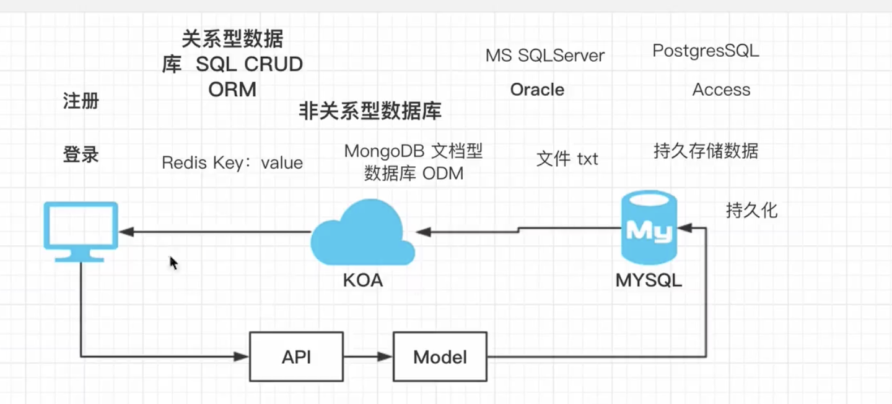

## Lin-Validator使用指南
```js
//validator.js
const { LinValidator , Rule}  = require('../../core/lin-validator')

class PositiveIntegerValidator extends LinValidator {
  constructor () {
      super()
      this.id = [
        new Rule('isInt', '需要正整数',{min:1})
      ]
  }
}

module.exports = {
  PositiveIntegerValidator
}
//使用
//const v = new PositiveIntegerValidator().validate(ctx)
```
## Lin-Validator获取HTTP参数
[validator.js-github](https://github.com/chriso/validator.js)
<!-- [lin-validator](doc.cms.7yue.pro/lin/server/koa/validator.html) -->
```js
class A {
    constructor() {
        this.nameA = 'a'
    }
    validateA() {
        console.log("A")
    }
}

class B extends A {
    constructor() {
        super()
        this.nameB = 'b'
    }

    validateB() {
        console.log("B")
    }
}

class C extends B {
    constructor() {
        super()
        this.nameC = 'c'
    }

    validateC() {
        console.log("C")
    }
}

function findMembers(instance, fieldPrefix, funcPrefix) {

    // 递归函数
    function _find(instance) {
         //基线条件（跳出递归）
        if (instance.__proto__ === null)
            return []

        let names = Reflect.ownKeys(instance)
        names = names.filter((name)=>{
            // 过滤掉不满足条件的属性或方法名
            return _shouldKeep(name)
        })
        
        return [...names, ..._find(instance.__proto__)]
    }

    function _shouldKeep(value) {
        if (value.startsWith(fieldPrefix) || value.startsWith(funcPrefix))
            return true
    }

    return _find(instance)
}


var c = new C()

// 编写一个函数findMembers

const members = findMembers(c, 'name', 'validate')
console.log(members)

// 原型链 查找 
```
## 配置文件与终端显示异常
//开发环境

//生产环境
```js
const {HttpException} = require('../core/http-exception')
const catchError = async (ctx,next)=>{
   try {
     await next()
   } catch(error){
     // 开发环境
     // 生产环境
     // 开发环境 不是HttpException
    const isHttpExcetion = error instanceof HttpException
    const isDev = global.config.environment === 'dev'
    if(isDev && !isHttpExcetion){
      throw error
    }
     if(isHttpExcetion){
       ctx.body = {
         msg:error.msg,
         error_code:error.errorCode,
         request:`${ctx.method} ${ctx.path}`
       }
       ctx.status = error.code
     } else {
       ctx.body = {
         msg : 'we make a mistake ^_^',
         error_code : 999,
         request : `${ctx.method} ${ctx.path}`
       }
       ctx.status = 500
     }
   }
}

module.exports = catchError
```
## 关系型数据库与与非关系型数据库

// 关系型数据库 sql crud orm操作方式
mysql sqlserver oracle postgresSql
// 菲关系型数据库 odm操作方式
redis（key：value建和值） mongodb(文档型数据库 json)

## Navicat管理MySQL

## Sequelize初始化配置与注意事项
```js
//db.js
const Sequelize = require('sequelize')
const {
  dbName,
  host,
  port,
  user,
  password
} = require('../config/config').database
console.log(dbName,user,password,host,port)
const sequelize = new Sequelize(dbName,user,password,{
  dialect:'mysql',
  host,
  port,
  logging:true,
  timezone:'+08:00',
  define:{
    //create_time update_time delete_time
    timestamps:true,
    paranoid:true,
    createdAt:'created_at',
    updatedAt:'updated_at',
    deletedAt:'deleted_at',
    underscored:true
  }
})

//开发阶段可使用
sequelize.sync({
  force:true
})
module.exports = {
  sequelize
}


```
## User模型与用户唯一标识探讨

```js
//user.js
const {sequelize} = require('../../core/db')

const {Sequelize,Model} = require('sequelize')

class User extends Model {
}

User.init({
  //主键 关系型数据库 
  id:{
    type:Sequelize.INTEGER,
    primaryKey:true,
    autoIncrement:true
  },
  nickname:Sequelize.STRING ,
  email:Sequelize.STRING ,
  password:Sequelize.STRING ,
  openid:{
    type:Sequelize.STRING(64),
    unique:true
  }
},{
  sequelize,
  tableName:'user'
})


```
## Sequelize个性化配置与数据维护策略

## LinValidator综合应用

```js
//user.js
const Router = require('koa-router')
const router = new Router({
  prefix:'/v1/user'
})
const { HttpException , ParameterException} = require('../../../core/http-exception')
const { RegisterValidator } = require('../../validators/validator')

//注册

router.post('/register',async (ctx) => {
  const v = new RegisterValidator().validate(ctx)
})

module.exports = router
//validator.js
class RegisterValidator extends LinValidator{
  constructor(){
    super()
    this.email = [
      new Rule('isEmail','不符合Email规范')
    ]
    this.password1 = [
      new Rule('isLength','密码最少6个字符，最多32个字符',{
        min:6,
        max:32
      }),
      new Rule('matches','密码不符合规范','^(?![0-9]+$)')
    ]
    this.password2 = this.password1
    this.nickname = [
      new Rule('isLength','昵称不符合长度规范',{
        min:4,
        max:32
      })
    ]
  }
  validatePassword(vals){
    const psw1 = vals.body.password1
    const psw2 = vals.body.password2
    if(psw1 !== psw2){
      throw new Error('两次密码必须相同')
    }
  }
}
```