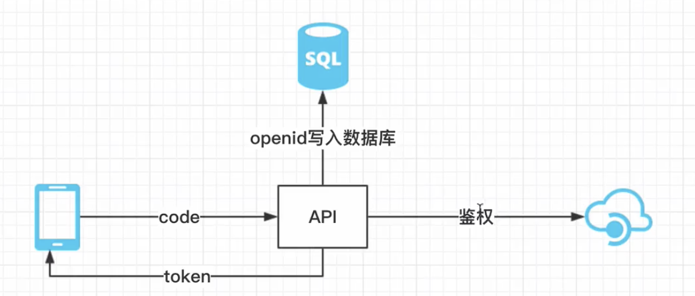

## jsonwebtoken
```js
//utils.js
const generateToken = function(uid, scope){
    const secretKey = global.config.security.secretKey
    const expiresIn = global.config.security.expiresIn
    const token = jwt.sign({
        uid,
        scope
    },secretKey,{
        expiresIn
    })
    return token
}
//token.js
router.post('/',async (ctx) => {
  const v = await new TokenValidator().validate(ctx)
  let token 
  // type
  // email 小程序
  switch (v.get('body.type')){
    case LoginType.USER_EMAIL:  
      token =  await emailLogin(v.get('body.account'),v.get('body.secret'))
      break;
    case LoginType.USER_MINI_PROGRAM:
      break;
    default:
      throw new global.errs.ParameterException('没有对应的处理函数')
  }
  ctx.body = {
    token
  }
})

async function emailLogin(account,secret){
  const user = await User.verifyEmailPassword(account,secret)
  return token = generateToken(user.id,2)
}
```
## HttpBasicAuth传递令牌
```js
//token进行检测
//token body header 
// HTTP 约定 身份验证机制 HttpBasicAuth
```
## 验证JWT令牌
```js
//middleware.js
const basicAuth = require('basic-auth')
const jwt = require('jsonwebtoken')
class Auth {
  constructor(){

  }
  get m(){
    return async (ctx,next) => {
      const userToken = basicAuth(ctx.req)
      let errMsg = 'token不合法'
      if(!userToken|| !userToken.name){
        throw new global.errs.Forbbiden(errMsg)
      }
      try {
       var decode =  jwt.verify(userToken.name,
          global.config.security.secretKey)
      } catch (err) {
        // token不合法
        // token过期
        if(error.name == 'TokenExpiredError'){
          errMsg = 'token已过期'
        }
        throw new global.errs.Forbbiden(errMsg)
      }
      ctx.auth = {
        uid : decode.uid,
        scope:decode.scope
      }
      await next()
    }
  }
}
module.exports = {
  Auth
}
//classic.js
router.get('/latest',new Auth().m,async (ctx,next) => {
  ctx.body = ctx.auth.uid
}
```
## API权限分级控制
```js
class Auth {
  constructor(level) {
    this.level = level || 1
    Auth.USER = 8
    Auth.ADMIN = 16
    Auth.SUPER_ADMIN = 32
  }
   if(decode.scope < this.level) {
        errMsg = '权限不足'
        throw new global.errs.Forbbiden(errMsg)
  }
}
```
## 小程序openid登录系统

## 微信鉴权 openid 与 unionid
```js

const util = require('util')
const axios = require('axios')
class WXManager {

  static async codeToToken(){
    const url = util.format(global.config.wx.loginUrl,
      global.config.wx.appId,
      global.config.wx.appSecret,
      code)
    const result = await axios.get(url)
    if(result.status !== 200){
      throw new global.errs.AuthFailed('openid获取失败')
    }
    const errcode = result.data.errcode
    if(errcode !== 0){
      throw new global.errs.AuthFailed('openid获取失败:'+errmsg)
    }
  }

}
```
## 根据openid创建微信用户

```js
//token.js
 case LoginType.USER_MINI_PROGRAM:
      token = await WXManager.codeToToken(v.get('body.account'))
      break
//wx.js
 static async codeToToken(code){
    const url = util.format(global.config.wx.loginUrl,
      global.config.wx.appId,
      global.config.wx.appSecret,
      code)
    const result = await axios.get(url)
    if(result.status !== 200){
      throw new global.errs.AuthFailed('openid获取失败')
    }
    const errcode = result.data.errcode
    const errmsg = result.data.errmsg
    if (errcode){
        throw new global.errs.AuthFailed('openid获取失败:'+errmsg)
    }
    // openid
    // 档案user uid openid比较长效率低 
    let user = await User.getUserByOpenid(result.data.openid)
    if(!user){
      user = await User.registerByOpenid(result.data.openid)
    }
    return generateToken(user.id,Auth.USER)
  }
//model/user.js
  static async getUserByOpenid(openid){
    const user = await User.findOne({
      where:{
        openid
      }
    })
    return user
  }
  static async  registerByOpenid(openid){
    return await User.create({
      openid
    })
  }
```