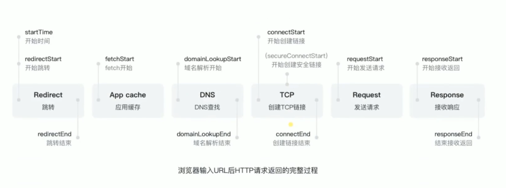

- 浏览器里面有个api perfomance 会帮我们记录每一个时间点
- 第一（跳转）：一开始浏览器就要判断我们是否需要redirect(因为我们的浏览器可能记录了你输入的地址是永久跳转成新地址的记录)，以及我们要redirect到哪里去  startTime redirectStart Redirect redirectEnd
- 第二(缓存)：看缓存 fetchStart App cache
- 第三（dnf查找）：dns解析：因为我们输入的是域名，域名要对应到ip，我们才能真正的访问到服务器 domainLookupStart 域名解析开始 DNS查找 domainLookupEnd 域名解析结束 拿到ip
- 第四（TCP链接）：通过3次握手创建tcp链接，如果是https,还有一个安全的处理 connectStart 如何是https 还有secureConnectStart connectEnd
- 第五request：开始发送http数据的请求包 requestStart
- 第五response：服务器拿到数据请求包，然后返回我们想要的内容，返回数据才是真正的完成 responseStart responseEnd