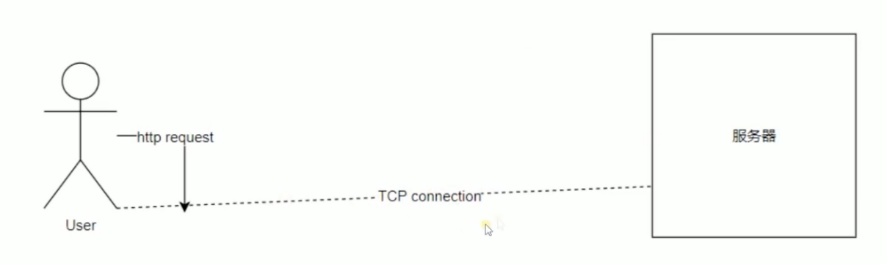
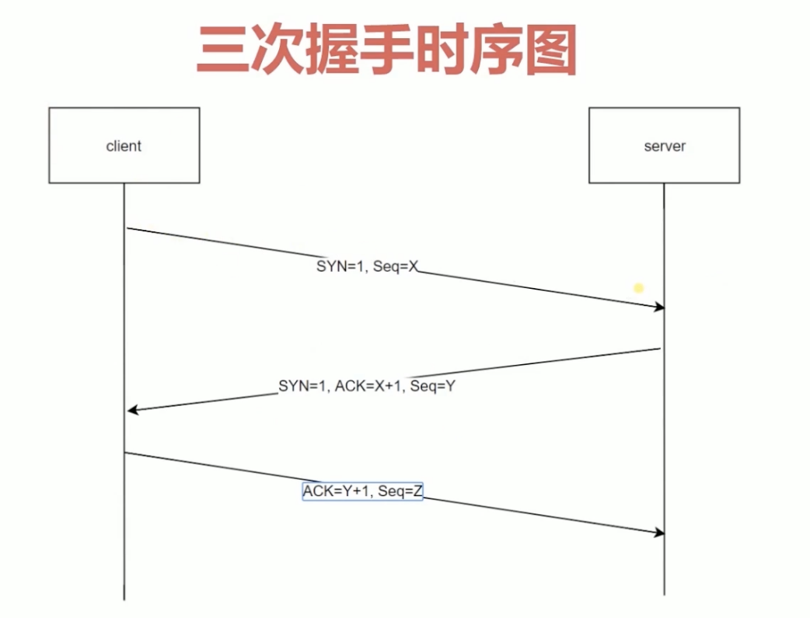

## HTTP三次握手🤝
[参考链接1](https://blog.csdn.net/qzcsu/article/details/72861891) 
[参考链接2](https://blog.csdn.net/ityouknow/article/details/86710128) 

> 我们客户端和发服务发起http request的时候需要创建一个TCP connection的通道
http没有连接的概念只有请求和响应的概念，请求和响应是一个数据包，并没有连接的概念，传输的通道是通过TCP创建一个通道。在TCP的通道上面我们是可以发送多个http请求的。TCP创建的时候就会有三次握手消耗（三次网络请求 客户端->服务端 服务端->客户端 客户端->服务端）。如果保持链接，再次发送http请求就没有三次握手的消耗。http2里面请求是可以并发的，同一个用户对同一个服务器发送http请求的时候只需要创建一个http请求

> http三次握手 

防止服务端开启无意义开销

