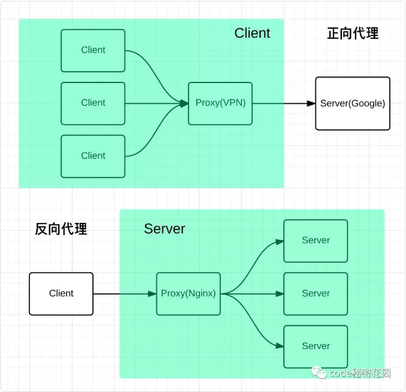

nignx
=

### nginx在程序中的作用
- 解决跨域
- 请求过滤
- 配置gzip
- 负载均衡
- 静态资源服务器

:::tip
nginx是一个高性能的HTTP和反向代理服务器，也是一个通用的TCP/UDP代理服务器，最初由俄罗斯人Igor Sysoev编写。
:::
代理是在服务器和客户端之间假设的一层服务器，代理将接收客户端的请求并将它转发给服务器，然后将服务端的响应转发给客户端。

- 正向代理
:::tip
意思是一个位于客户端和原始服务器(origin server)之间的服务器，为了从原始服务器取得内容，客户端向代理发送一个请求并指定目标(原始服务器)，然后代理向原始服务器转交请求并将获得的内容返回给客户端 --(就是vpn)
:::

正向代理是为我们服务的，即为客户端服务的，客户端可以根据正向代理访问到它本身无法访问到的服务器资源。

正向代理对我们是透明的，对服务端是非透明的，即服务端并不知道自己收到的是来自代理的访问还是来自真实客户端的访问
- 反向代理
:::tip
* 反向代理*（Reverse Proxy）方式是指以代理服务器来接受internet上的连接请求，然后将请求转发给内部网络上的服务器，并将从服务器上得到的结果返回给internet上请求连接的客户端，此时代理服务器对外就表现为一个反向代理服务器。
:::
反向代理是为服务端服务的，反向代理可以帮助服务器接收来自客户端的请求，帮助服务器做请求转发，负载均衡等。

反向代理对服务端是透明的，对我们是非透明的，即我们并不知道自己访问的是代理服务器，而服务器知道反向代理在为他服务。

[参考](https://mp.weixin.qq.com/s/BA_JZ_kMBFZBE7jjQDNc1Q)