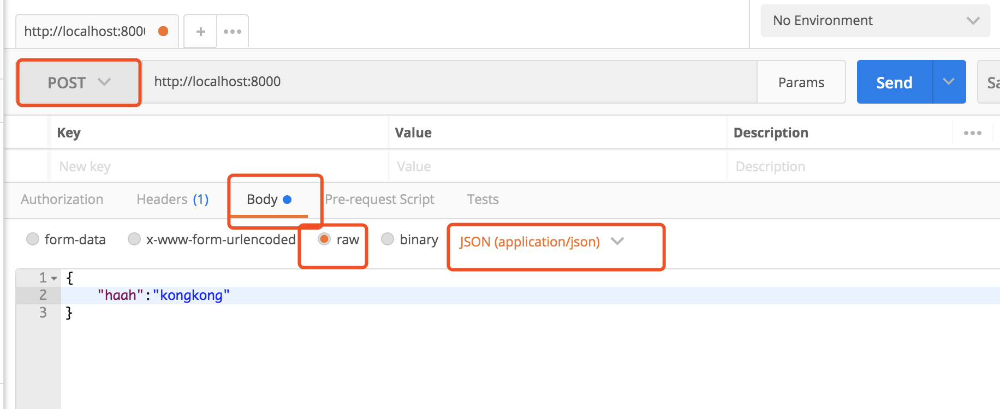

###
- 1 DNS解析，建立tcp连接,发送HTTP请求
- 2 serve接收到http请求，处理，并返回结果
- 3 客户端接受返回数据处理数据(如渲染页面，执行js)

### node-serve

- get请求和querystring
- post请求和postdata
- 路由

基础demo
```js
const http = require('http')
const server = http.createServer((req,res)=>{
  res.end('<h1>hello</h1>')
})
server.listen(3000)
```

- nodejs处理get请求

```js
//http://localhost:4000/?xixi=1&hah=sdda
const http = require('http')
const querystring = require('querystring')

const server = http.createServer((req,res)=>{
  const url = req.url
  req.query = querystring.parse(url.split('?')[1])
  res.end(JSON.stringify(req.query))
})
server.listen(8000)
```
- nodejs处理post请求
```js
const http = require('http')
const server = http.createServer((req,res)=>{
  if(req.method === 'POST'){
    //数据格式
    let postData = ""
    req.on('data',chunk=>{
      postData+=chunk.toString()
    })
    req.on('end',()=>{
      res.end('hello word')
    })
  }
})
server.listen(8000)
```

### postman


- 简单综合案例应用

```js
// http://localhost:8000/hha/sdsa?ok=1&ds=21
const http = require('http')
const querystring = require('querystring')

const server = http.createServer((req,res)=>{
  const method = req.method
  const url = req.url
  const path = url.split('?')[0]
  const query = quertstring.parse(url.split('?')[1])
  //设置返回值格式为JSON
  res.setHeader('Content-type','application/json')
  //返回的数据
  const resData = {
    method,
    url,
    path,
    query
  }
  //返回
  if(method === 'GET'){
    res.end(
      JSON.stringify(resData)
    )
  }
  if(method === 'POST'){
    let postData = ''
    req.on('data',chunk =>{
      postData += chunk.toString()
    })
    req.on('end',()=>{
      res.end(
        JSON.stringify(resData)
      )
    })  
  }
})
// {
//     "method": "POST",
//     "url": "/hha/sdsa?ok=1&ds=21",
//     "path": "/hha/sdsa",
//     "query": {
//         "ok": "1",
//         "ds": "21"
//     }
// }
server.listen(8000)
```