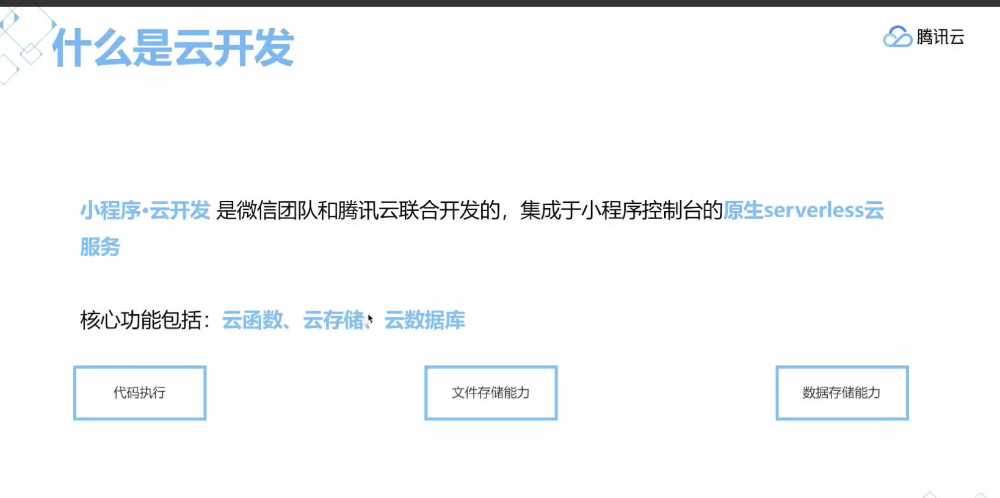
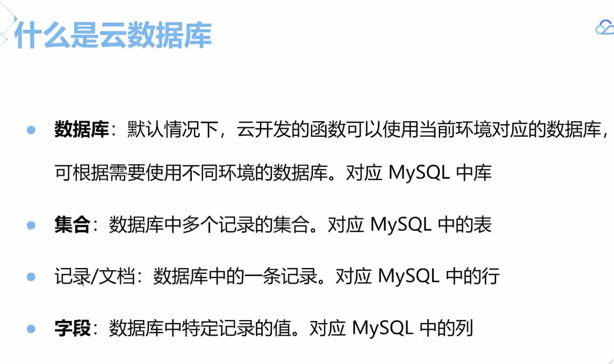

[官方视频](https://cloud.tencent.com/edu/learning/learn-1414/7965)

> 什么是云函数
1. 原生支持
2. 弹性收缩
3. 私有协议
> 管理云函数
1. 创建，安装依赖及部署
2. 云函数配置
3. 云函数调试
4. 运行日志
5. 数据监控
> 获取用户登陆
1. 直接调用getWXContent
> 云存储
1. 云开发为开发者提供了存储空间，包含了上传文件到云端，带权限管理的云端下载能力，开发者可以在小程序端和云函数端通过API使用云文件存储功能
> 管理文件
1. 上传文件
2. 文件信息查看
3. 文件夹管理
4. 权限管理
> 什么是云数据库
> 云数据库是云开发提供的一个文档型数据库，数据库中的每条记录是一个JSON格式的对象，一个数据库可以有多个集合，集合可以看做一个JSON数据，数组中的每个对象就是一条记录，记录的格式是JSON对象
1. 文档型
2. 简单易用
3. 权限控制
